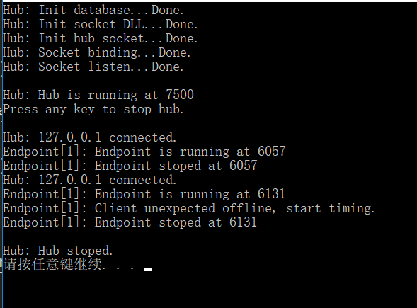
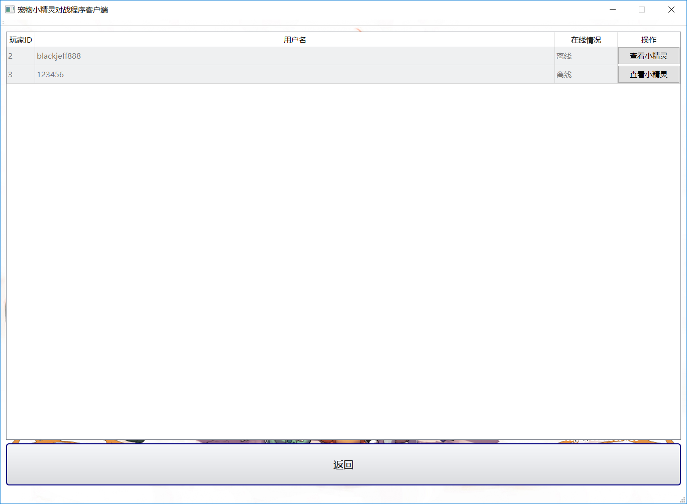
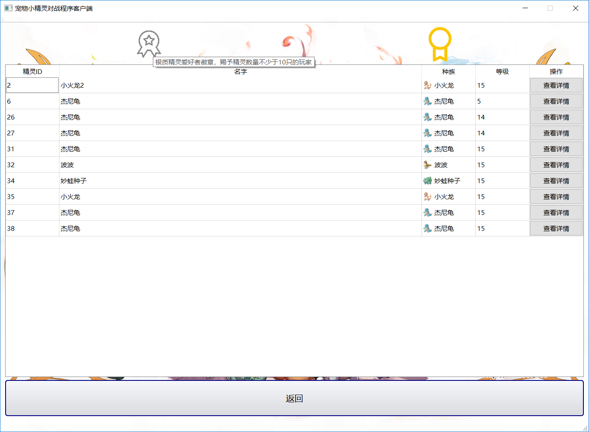
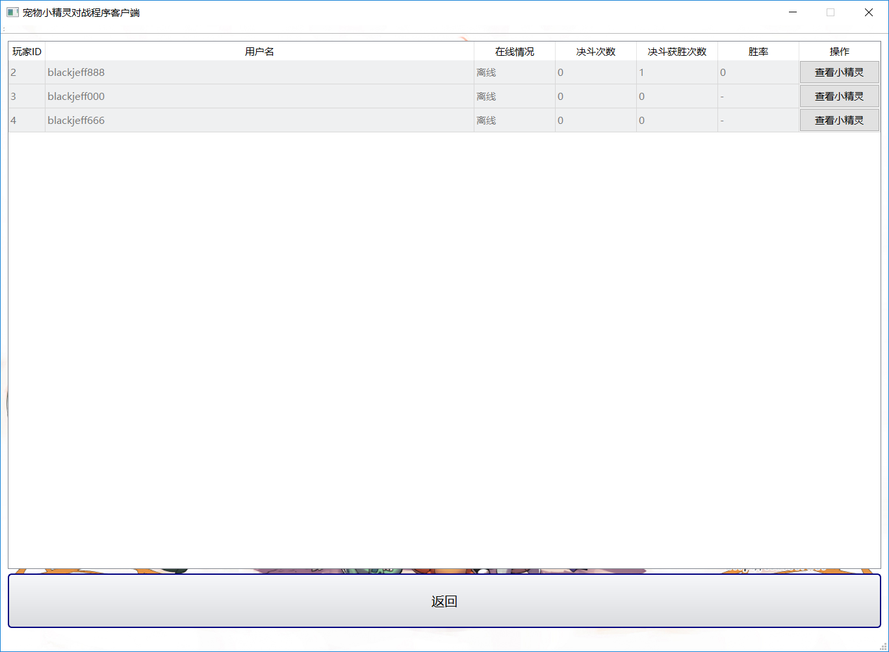

# 宠物小精灵对战系统


- [宠物小精灵对战系统](#%E5%AE%A0%E7%89%A9%E5%B0%8F%E7%B2%BE%E7%81%B5%E5%AF%B9%E6%88%98%E7%B3%BB%E7%BB%9F)
  - [题目一：宠物小精灵的加入](#%E9%A2%98%E7%9B%AE%E4%B8%80%E5%AE%A0%E7%89%A9%E5%B0%8F%E7%B2%BE%E7%81%B5%E7%9A%84%E5%8A%A0%E5%85%A5)
    - [题目要求](#%E9%A2%98%E7%9B%AE%E8%A6%81%E6%B1%82)
    - [小精灵宏观设计](#%E5%B0%8F%E7%B2%BE%E7%81%B5%E5%AE%8F%E8%A7%82%E8%AE%BE%E8%AE%A1)
    - [类的设计与实现](#%E7%B1%BB%E7%9A%84%E8%AE%BE%E8%AE%A1%E4%B8%8E%E5%AE%9E%E7%8E%B0)
      - [预备信息](#%E9%A2%84%E5%A4%87%E4%BF%A1%E6%81%AF)
      - [种族基类PokemonBase](#%E7%A7%8D%E6%97%8F%E5%9F%BA%E7%B1%BBpokemonbase)
      - [种族模板类template Race](#%E7%A7%8D%E6%97%8F%E6%A8%A1%E6%9D%BF%E7%B1%BBtemplate-race)
      - [小精灵类Pokemon](#%E5%B0%8F%E7%B2%BE%E7%81%B5%E7%B1%BBpokemon)
      - [战斗控制器类BattleController](#%E6%88%98%E6%96%97%E6%8E%A7%E5%88%B6%E5%99%A8%E7%B1%BBbattlecontroller)
      - [主程序main](#%E4%B8%BB%E7%A8%8B%E5%BA%8Fmain)
    - [其他细节](#%E5%85%B6%E4%BB%96%E7%BB%86%E8%8A%82)
    - [运行截图](#%E8%BF%90%E8%A1%8C%E6%88%AA%E5%9B%BE)
  - [题目二：用户注册与平台登录](#%E9%A2%98%E7%9B%AE%E4%BA%8C%E7%94%A8%E6%88%B7%E6%B3%A8%E5%86%8C%E4%B8%8E%E5%B9%B3%E5%8F%B0%E7%99%BB%E5%BD%95)
    - [题目要求](#%E9%A2%98%E7%9B%AE%E8%A6%81%E6%B1%82-1)
    - [服务端设计与实现](#%E6%9C%8D%E5%8A%A1%E7%AB%AF%E8%AE%BE%E8%AE%A1%E4%B8%8E%E5%AE%9E%E7%8E%B0)
      - [宏观设计](#%E5%AE%8F%E8%A7%82%E8%AE%BE%E8%AE%A1)
      - [详细设计-数据库相关](#%E8%AF%A6%E7%BB%86%E8%AE%BE%E8%AE%A1-%E6%95%B0%E6%8D%AE%E5%BA%93%E7%9B%B8%E5%85%B3)
      - [详细设计-网络通信相关](#%E8%AF%A6%E7%BB%86%E8%AE%BE%E8%AE%A1-%E7%BD%91%E7%BB%9C%E9%80%9A%E4%BF%A1%E7%9B%B8%E5%85%B3)
      - [Hub类的设计与实现](#hub%E7%B1%BB%E7%9A%84%E8%AE%BE%E8%AE%A1%E4%B8%8E%E5%AE%9E%E7%8E%B0)
      - [Endpoint类的设计与实现](#endpoint%E7%B1%BB%E7%9A%84%E8%AE%BE%E8%AE%A1%E4%B8%8E%E5%AE%9E%E7%8E%B0)
      - [Pokemon相关的改动](#pokemon%E7%9B%B8%E5%85%B3%E7%9A%84%E6%94%B9%E5%8A%A8)
      - [主程序](#%E4%B8%BB%E7%A8%8B%E5%BA%8F)
    - [客户端设计与实现](#%E5%AE%A2%E6%88%B7%E7%AB%AF%E8%AE%BE%E8%AE%A1%E4%B8%8E%E5%AE%9E%E7%8E%B0)
      - [Mainwindow类的设计与实现](#mainwindow%E7%B1%BB%E7%9A%84%E8%AE%BE%E8%AE%A1%E4%B8%8E%E5%AE%9E%E7%8E%B0)
      - [LogonDlg类的设计与实现](#logondlg%E7%B1%BB%E7%9A%84%E8%AE%BE%E8%AE%A1%E4%B8%8E%E5%AE%9E%E7%8E%B0)
      - [PokemonDlg类的设计与实现](#pokemondlg%E7%B1%BB%E7%9A%84%E8%AE%BE%E8%AE%A1%E4%B8%8E%E5%AE%9E%E7%8E%B0)
    - [运行截图](#%E8%BF%90%E8%A1%8C%E6%88%AA%E5%9B%BE-1)
  - [题目三：游戏对战的设计](#%E9%A2%98%E7%9B%AE%E4%B8%89%E6%B8%B8%E6%88%8F%E5%AF%B9%E6%88%98%E7%9A%84%E8%AE%BE%E8%AE%A1)
    - [题目要求](#%E9%A2%98%E7%9B%AE%E8%A6%81%E6%B1%82-2)
    - [服务端设计](#%E6%9C%8D%E5%8A%A1%E7%AB%AF%E8%AE%BE%E8%AE%A1)
    - [客户端设计](#%E5%AE%A2%E6%88%B7%E7%AB%AF%E8%AE%BE%E8%AE%A1)
    - [运行截图](#%E8%BF%90%E8%A1%8C%E6%88%AA%E5%9B%BE-2)

## 题目一：宠物小精灵的加入

### 题目要求

- 设计宠物小精灵的类，为简化游戏设计，精灵的属性包括种类（力量型：高攻击； 肉盾型：高生命值； 防御型：高防御； 敏捷型：低攻击间隔，共四种）、名字、等级、经验值、攻击力、防御力、生命值、攻击间隔等（以上属性必须，其他属性可自行添加）（基本要求：本游戏中只有上面的4种类型。 进一步要求：上述4种类型可以进一步深入划分，比如力量型又可以在细分为：沙瓦朗、火爆猴、腕力等）
- 每个精灵初始等级为1，满级15级，每当精灵升级的时候，宠物对应的属性值会有少量增加（主属性增加量相对较多）
- 每个精灵有自己独特的攻击方式，如“闪电攻击”，“火焰攻击”等等，请设计一个精灵的基类，并将精灵的攻击方法设为虚方法以方便子类重写
- 请写一个测试程序对设计的精灵类的相关属性和方法（包括攻击函数，升级函数等）进行测试
- 题目考察点：类的继承，对象数据成员设计，成员函数设计

### 小精灵宏观设计

设计小精灵包括以下属性：
- 种族
- 名字
- 攻击力
- 防御力
- 速度（反映攻击间隔）
- 等级
- 经验值

小精灵的种族包括以下属性：
- 种族名
- 种族类型（高攻击、高防御、高血量、高速度四种）
- 种族基础攻击
- 种族基础防御
- 种族基础血量
- 种族基础速度
- 种族经验曲线
- 种族技能（四个）、每个技能的描述和技能释放次数（PP点）

关于小精灵的技能，设置如下规则：
- 每个种族的小精灵有四个技能，包括一个普通攻击和三个特殊技能
- 普通攻击不消耗技能释放次数，即普通攻击可以无限次释放，防止持久战双方没有技能可以释放
- 小精灵在1级的时候只拥有普通攻击，在5级习得第二个技能，10级习得第三个技能，15级（满级）习得第四个技能
- 能够对对方造成伤害的技能拥有一定的被闪避几率，此几率和双方小精灵的速度有关

关于小精灵属性的提升：每个小精灵在初始化的时候会首先被赋予其种族的基础属性（即种族基础攻击等等），在每次等级提升的时候属性的增加具有一定的随机性，这就要求后期使用数据库存储小精灵数据的时候需要把小精灵的所有属性都保存在数据库中。

### 类的设计与实现

#### 预备信息

>在说明以下内容之前需要知道的信息

定义了dbout作为信息输出，定义了dbin作为信息输入。目前dbout为cout，dbin为cin。

种族类型（也可以称为精灵类型）为枚举量PokemonType，定义了高攻击、高防御、高血量、高速度这四种种族类型。

#### 种族基类PokemonBase

设计类PokemonBase作为所有精灵种族的基类。

此类包含了上文中精灵种族应该包含的所有属性，但是在初始化的时候不会给全部这些属性都赋值（如种族名、种族技能这些都需要具体构造种族的时候才能够确定），所以PokemonBase把所有属性的访问属性设置成了protected以便子类（即各个种族类）访问与修改。

此类还声明了种族各属性的getter函数，以便基类指针能够访问子类（种族类）中初始化的属性。

此类的构造函数仅需要提供一个参数：种族类型。在此类的构造函数中会先根据种族类型对种族基础攻击、种族基础防御等属性进行初始化。此处的初始化没有添加随机性，所以种族类型相同的精灵在1级的时候拥有完全相同的属性。

此类提供了攻击函数attack。由于两个小精灵的**攻击并不会对种族属性造成影响**，只会对小精灵的个体战时属性造成影响，所以此函数是一个const函数，且需要提供两个小精灵的非const引用作为参数以便修改两个小精灵的属性。此函数设计为纯虚函数以便子类实现和被外界通过基类指针访问。

#### 种族模板类template Race

模板类Race使用精灵种族编号作为模板参数。如0号种族为`Race<0>`，1号种族为`Race<1>`。此模板类表示了不同的精灵种族，如妙蛙种子、小火龙等。

此类的构造函数首先根据种族类型的不同而调用PokemonBase的构造函数，使种族的数值属性（种族基础攻击力、种族基础防御力等）根据种族类型而确定下来，然后对以下没有在PokemonBase的构造函数中初始化的数据进行初始化：
- 种族名
- 种族经验曲线
- 种族技能名（4个）
- 种族技能描述（4个）
- 技能释放次数

此类实现了PokemonBase中声明的纯虚函数attack。在此函数中，首先根据传入的参数skillIndex判断攻击方小精灵使用了哪个技能，每个技能有不同的伤害计算公式或效果，如果技能命中且对方血量为0则返回true表示战斗结束。

#### 小精灵类Pokemon

此类除了包含每个小精灵的个体属性，还要包含小精灵的战时个体属性，因为在战斗中小精灵的某些属性会得到临时性的更改。这些战时个体属性包括：
- 血量
- 攻击力
- 防御力
- 速度
- 每个技能的剩余技能释放次数

此类提供了所有属性（包括战时个体属性和普通个体属性）的getter函数，但是仅提供了战时个体属性的setter函数，因为普通个体属性仅能够通过经验获取函数gainExp在判定为升级的情况下被修改。

关于战斗，此类提供了如下函数：
- restoreAll
  - 使战时个体属性恢复为普通个体属性，用于战斗前两只精灵的恢复（初始化）
- attack
  - 指定另一只Pokemon作为目标进行攻击。
  - 此函数会根据等级和剩余技能释放次数对玩家选择的技能进行判定，如果判定玩家选择了某个剩余技能释放次数不足的技能或某个当前等级无法释放的技能，则会释放普通攻击。
  - 在选择自动战斗时，此函数会随机选择一个符合等级条件且剩余技能释放次数非0的技能进行释放。选择手动战斗时，将使用dbin从控制台进行输入。
  - 此函数仅作为战斗的控制函数，实际的战斗会调用种族的战斗函数进行各属性的计算。
- takeDamage
  - 减少当前Pokemon的生命值。
  - 如果当前Pokemon的生命值为0则返回false表示此精灵战败。
  - 当参数（精灵应承受的伤害）小于某阈值时，设置伤害为此阈值。防止因对方精灵防御过高而造成的战斗流程缓慢。
- gainExp
  - 给当前精灵增加经验
  - 如果精灵升级，返回true。
  - 如果精灵已经满级（15级）则增加经验无效。
  - 内部使用一个循环来实现一次性增加大量经验造成的连续升级的效果。
  - 精灵升级后会在一定浮动范围内增加自己的属性，也会因为自己的种族类型而在某个属性上有更多的增益。

每个小精灵可以拥有自己的名字。如果在构造时没有提供小精灵的名字，则小精灵的名字被初始化为种族的名字。

#### 战斗控制器类BattleController

构造函数包括两个小精灵的非const引用和一个自动战斗标志位。

调用函数start后，战斗开始。战斗控制器中的计数器timer将会增加，当达到某个小精灵的速度值时，另一只小精灵应该发起攻击。调用Pokemon的attack函数实现攻击。

如果判定双方应该同时攻击，则速度快的一方优先进行攻击。

当战斗的一方血量为0时战斗结束，start函数结束。

#### 主程序main

主程序首先使用时间函数初始化随机数种子以便后期产生随机数，然后初始化四个种族以便后面初始化小精灵时使用。

初始化小精灵，调用gainExp以测试升级函数的效果。构造BattleController来实现战斗，调用BattleController::start启动战斗即可。

### 其他细节

目前仅设计了小火龙（高攻击）、妙蛙种子（高血量）、杰尼龟（高防御）、波波（高速度）四个种族。

### 运行截图

- 生成小精灵：


- 获取经验与升级：


- 战斗开始：


- 战斗结束：


## 题目二：用户注册与平台登录

### 题目要求

- 每个用户需要注册一个账号，用户名全局唯一，不能有任何两个用户名相同，要考虑注册失败的场景时的反馈
- 实现注册、登录、登出功能，均采用C/S模式，客户端和服务端用socket进行通信，服务端保存所有用户的信息（文件存储或数据库均可，数据库有额外加分）
- 每个用户拥有：用户名、拥有的精灵，两个属性。 用户注册成功时，系统自动随机分发三个1级精灵给用户
- 用户可以查看所有成功注册用户拥有的精灵，也可以查看所有当前在线的用户
- 如有界面设计可酌情加分
- 题目考察点：socket通信，交互场景反馈

### 服务端设计与实现

#### 宏观设计

**关于Socket通信**：服务器使用vs 2017作为开发环境，使用原生windows Socket作为通信基础。客户端使用Qt Creator作为开发环境，使用Qt提供的QTcpSocket作为通信基础。

**关于数据存储**：使用Sqlite3作为数据库管理程序，所有数据保存在服务器以防止外挂程序。

**关于中文显示与信息传递**：Qt使用UTF-8作为编码。由于vs 2017不支持不带BOM的UTF-8编码，所以服务端出现中文的文件使用GB2312编码。客户端识别时使用`QString QString::fromLocal8Bit(const char *str, int size = -1)`来实现字符转换，发送时如果信息包含中文也需要使用`QString.toLocal8Bit`来实现转换，以此实现中文信息传递。所以玩家可以把用户名和精灵名设置为中文。

**背景音乐**：Qt的媒体播放器库使用了第三方的插件。如果程序启动后没有背景音乐，可以尝试安装LAV filters。

**资源文件**：图片、音频等文件均作为资源文件保存在exe中，防止被用户替换。

**界面美化**：使用了类似于CSS语法的QSS设置程序样式，实现了样式与内容的分离。QSS文件不能使用UTF-8编码，此处使用了GB2312编码。

#### 详细设计-数据库相关

**数据库schema设计**：数据库中包含两个表，分别是用户表和精灵表。用户的用户名全局唯一，且用户拥有一个唯一的内部id。精灵表中保存了每个精灵的持有者的id，以便查询用户拥有的所有精灵。精灵表保存了所有精灵的属性。具体格式如下：

```sql
User(
	id integer primary key,
	name text unique not null,
	password text not null
);
Pokemon(
	id integer primary key,
	userid integer not null,
	name text not null,
	race int not null,
	atk int not null,
	def int not null,
	maxHp int not null,
	speed int not null,
	lv int not null,
	exp int not null,
);
```

#### 详细设计-网络通信相关

服务器分为两个部分：一个Hub和一个Endpoint集合。Hub运行在7500端口，负责处理注册和登录的请求，为短链接，返回数据后立即断开连接。如果是登录请求，在登录成功的情况下会new一个Endpoint负责与用户对接，Socket会返回一个新的端口号。此端口号为操作系统分配的空闲端口号。

Endpoint将和每个用户进行长链接，直到用户退出登录。Endpoint处理用户在登录状态下的各种请求，包括：
- 重置密码
- 获取玩家列表
- 获取精灵列表
- 获取单个精灵详细信息
- 精灵改名
- 退出登录

此外，Endpoint还能够检测用户的意外断线。如果用户没有正常退出登录，则Endpoint不会立即销毁，而是会等待一段时间给用户重连，防止用户频繁掉线时Endpoint被频繁生成与销毁的问题。

网络通信接口定义如下：

- Hub提供的接口
  - `login <username> <password>`
    - 返回端口号则登录成功，否则返回错误信息
  - `logon <username> <passwprd>`
    - 返回`Accept.\n`则注册成功，否则返回错误信息
- Endpoint提供的接口
  - `logout`
    - 退出登录，无返回消息
  - `resetPassword <oldPassword> <newPassword>`
    - 重置密码。返回`Accept.\n`则重置成功，否则返回错误信息
  - `getPlayerList`
    - 返回所有玩家的信息。
    - 单个玩家信息格式为`<userID> <userName> <online: 0 | 1>`
    - 不同玩家信息使用换行符隔开
  - `getPokemonList [playerID]`
    - 如果不给出playerID则返回自己的小精灵概要信息。否则返回指定玩家的小精灵概要信息
    - 单个小精灵信息格式为`<id> <name> <raceName> <lv>`
    - 不同小精灵信息使用换行符隔开
  - `getPokemon <pokemonID>`
    - 根据小精灵id获取小精灵的详细信息
    - 返回信息格式为`<id> <name> <raceName> <atk> <def> <maxHp> <speed> <lv> <exp>`
  - `pokemonChangeName <pokemonID> <newName>`
    - 返回`Accept.\n`表示改名成功

#### Hub类的设计与实现

Hub类被设计为**单件**，其所有构造函数的访问属性均为private，且除了默认构造函数外的其他构造函数与赋值函数均被delete。只能通过public静态函数getInstance来获得单件的引用。

Hub管理着一个Endpoint的列表。此列表使用vector实现频繁的插入与删除。

因为endpoints会被多线程访问，所以使用互斥量std::mutex保护多线程下的endpoints。

初始情况下Hub只有两个线程，一个是listenFunc线程，用来处理登录和注册的请求。另一个是ternimateFunc线程，用来实现Hub运行时按下任意键停止Hub的效果。

用户发出登录请求时，首先会判断此用户在数据库是否存在。如果存在则检查当前是否已经有对应此用户的Endpoint。如果有，而且此Endpoint正在运行，则因为用户多次登录而拒绝请求。如果Endpoint处于用户意外断线的等待状态，则重新激活此Endpoint并和用户建立连接。如果不存在对应的Endpoint，则new一个Endpoint，并detach出去一个mornitor线程。mornitor线程中会调用Endpoint::process函数以启动Endpoint。因为Endpoint::process是阻塞函数，所以当此函数返回时，mornitor线程会从endpoints中delete掉此Endpoint。所以每个Endpoint都会有一个对应的mornitor线程在运行。拓扑图如下：


调用Hub::start函数以启动服务器（阻塞方式）。此函数会连接数据库（或新建数据库），初始化Socket，并启动上述两个Hub中的基础线程。任何一个初始化项目失败，或者两个基础线程终止，则start函数会返回。

#### Endpoint类的设计与实现

Endpoint类负责实现登陆后的其他用户请求。这些请求无非就是简单数据库操作，此处不再赘述。下文将重点描述如何实现Endpoint检测用户意外离线后的等待机制。

Endpoint::process函数如下：

```c++
void Endpoint::process()
{
	while (running)
	{
		online = false;
		timing = true;

		thread timerThread(&Endpoint::timer, this);
		thread listenThread(&Endpoint::listenFunc, this);
		timerThread.join();
		listenThread.join();
	}
}
```

Endpoint类设置了两个标志变量online和timing负责记录“是否在线”和“是否在计时”两个值。然后启动了timer线程和listen线程。也就是说用户发送登录请求，Hub回复Endpoint的端口之后，Hub::mornitor线程调用Endpoint::process的时候，计时就已经开始了。玩家需要在指定时间之内连接到Endpoint，否则也会因为长时间未连接而导致Endpoint被销毁。

当用户连接到Endpoint，Endpoint::listenFunc中的accept函数被触发后，Endpoint将会把online置为true，然后尝试停止计时。此处使用了std::condition_variable条件变量来实现。在timer线程中，函数被condition_variable::wait_for函数阻塞，相当于是一个非忙等待的条件sleep函数。listenFunc会调用condition_variable::notify_one函数来通知timer中的wait_for函数，以此实现timer停止等待的效果。timer停止等待后判断online标志，如果online为true表示online已经被listenFunc处理了，则把timing设置为false。否则即为等待超时，关闭Socket以停止listenFunc，并把running设置为false以停止process函数的循环。process函数执行完毕后就会被Hub::mornitor函数销毁。

客户端连接Endpoint后timer线程执行完毕。客户端意外断开时listen线程也会执行完毕，但是running此时仍为true，此时就会执行process函数中的循环，重新启动timer和listen线程监听客户端时间与计时，以此实现离线等待机制。

#### Pokemon相关的改动

服务器的Pokemon函数增加了构造函数，给出所有属性值以构造一个精灵，用来把从数据库读出的精灵数据构造为精灵。

Pokemon类内定义了静态public成员变量races，为PokemonBase的指针。用来以静态的方式初始化四个种族。代码如下：

```c++
const PokemonBase *Pokemon::races[4] = {new Race<0>(), new Race<1>(), new Race<2>(), new Race<3>()};
```

由于第二版不涉及战斗，所以其他Pokemon相关函数没有进行修改。

#### 主程序

主程序只要启动Hub即可。代码如下：

```c++
int main()
{
	srand(time(NULL));
	Hub &hub = Hub::getInstance();
	hub.start();
	system("pause");
}
```

### 客户端设计与实现

#### Mainwindow类的设计与实现

本次项目并没有很多地使用ui文件，几乎一切Qt控件都是用代码构造出来初始化与管理的。

MainWindow使用了有限状态自动机来管理当前所处状态（页面）。一共有如下若干状态：
- 初始状态START
  - 显示“开始游戏”按钮和“退出游戏”按钮。
- 登录状态LOGIN
  - 显示登录时需要的输入框、返回按钮、注册按钮和登录按钮。
- 主状态MAIN
  - 显示所有功能，即查看自己的精灵、查看所有用户和他们的精灵、修改密码、退出登录。
- 精灵表POKEMON_TABLE
  - 一个表格，显示精灵的简要属性。表格中有显示精灵属性详情的按钮
- 玩家表PLAYER_TABLE
  - 一个表格，显示玩家的属性。表格中有查看指定玩家精灵的按钮

界面的转换通过changeState函数实现。此函数首先将所有控件重置并隐藏，然后根据当前状态显示指定的控件，并使用QGridLayout进行布局

网络通信使用QTcpSocket异步通信实现，使用`connect(client, &QTcpSocket::readyRead, this, &MainWindow::getServerMsg);`连接readyRead函数与getServerMsg函数，所有信息通过getServerMsg函数进行处理。

getServerMsg函数也会根据当前状态对来自服务器的信息进行不同的解析，然后对显示的内容进行一定程度的修改。

MainWindow还使用了QMediaPlayer实现了背景音乐的播放。

#### LogonDlg类的设计与实现

LogonDlg是玩家点击注册按钮时弹出的窗体。此窗体使用模式化显示，此窗体关闭前无法对MainWindow进行操作。

玩家点击注册按钮时，注册按钮会被disable以防网络速度慢时玩家多次点击注册按钮造成其他不可预测结果。但是取消按钮没有disable，玩家依然可以点击取消按钮终止注册。

玩家注册成功时，窗体会自动消失，并把刚才注册成功的账号与密码自动填充到MainWindow的输入框中。

#### PokemonDlg类的设计与实现

PokemonDlg是玩家点击精灵表中的精灵详情按钮时弹出的窗体，显示精灵详情。如图：


为了方便玩家进行精灵之间属性的对比，玩家可以同时打开不限量个PokemonDlg。玩家每次点击MainWindow中的查看详情按钮都会new一个PokemonDlg出来。对此，为了防止内存泄露，在PokemonDlg的构造函数中添加了`setAttribute(Qt::WA_DeleteOnClose);`使用户在关闭窗体时就会delete掉窗体。

玩家可以在MainWindow的精灵表中对自己的精灵进行重命名，也可以在PokemonDlg中进行重命名。双击对应的表项，PokemonDlg会发送一个信号来改变MainWindow中的表项，从而实现和MainWindow的精灵表同步更改精灵名称的效果。

### 运行截图

- 服务器初始化：


- 服务器接收用户登录：


- 用户正常退出：


- 用户非正常退出：


- 用户超时，Endpoint销毁：


- 按下任意键停止服务器：



- 客户端初始界面：


- 登录界面：


- 注册界面：


- 客户端主界面：


- 重置密码界面：


- 精灵列表界面：


- 玩家列表界面：



## 题目三：游戏对战的设计

### 题目要求

- 已经登录的在线用户可以和服务器进行虚拟决斗，决斗分两种：升级赛和决斗赛，两种比赛都能增长宠物经验值。服务器上有一个虚拟精灵的列表，用户可以挑选其中任意一个进行比赛（升级赛或者决斗赛）。另外决斗赛中用户胜出可以直接获得该战胜的的精灵，失败则系统从用户的精灵中随机选三个（不够三个精灵的情况就选择他所有的精灵），然后由用户选一个送出。
	- 升级赛 只是用户用来增加精灵经验值，规则开发者自定；
	- 累积多少经验值升一级，规则开发者自定；
	- 决斗赛的上述规则同升级赛，只是额外还可以赢得宠物一个。
- 用户如果没有精灵（比如总是失败，已经全部送出去），则系统会随机放给给他一个初级精灵。
- 请让你的系统自动模拟每场比赛的每次出招。另外，为了增加不确定性，可以加入概率闪避攻击和暴击伤害机制
	- 比赛的过程和结果由系统根据上述规则自动模拟完成，要求结果具有一定的随机性。
- 用户增加新功能，可以查看某个用户的胜率
- 用户增加新属性，为宠物个数徽章（金银铜）和高级宠物徽章（金银铜），分别根据拥有的宠物个数的多少和拥有高级宠物（15级）个数的多少颁发
- 如有界面设计可酌情加分，如有新颖设计可酌情加分
- 题目考察点：客户端与服务器数据交互（可采用多进程或异步通信或其他方法均可），并发请求处理，类的方法设计，伤害计算方法设计。

### 服务端设计

第三版主要用于实现战斗。

Endpoint添加以下接口：

- `battle <type: LV_UP | DUEL> <pokemonID> <enemyRaceID> <enemyLV>`
  - 发起战斗请求，包括战斗类型（升级比赛或决斗比赛），己方精灵ID，敌方种族和敌方等级
  - 返回消息见下文“战斗同步问题”
- `useSkill <skillID>`
  - 使用技能
  - 返回消息见下文“战斗同步问题”
- `getDuelStatistic`
  - 返回玩家的战斗统计信息，包括获胜场数和总决斗场数
  - 返回信息格式：`<win> <total>`
- `chooseBet`
  - 服务器挑选三个精灵返回给玩家，玩家选择一个丢弃
  - 调用getPokemonByID函数返回三次消息，每次返回一个Pokemon的详情
- `discard <pokemonID>`
  - 丢弃指定ID的精灵
  - 无返回消息

Pokemon类添加静态函数getEnemy，能够通过敌人种族和等级构造一个精灵作为玩家精灵的对手。

Pokemon原本的attack函数拆分为两个函数，分别是：

```c++
bool attack(Pokemon &aim, string &msg); // auto attack
bool attack(Pokemon &aim, int skillIndex, string &msg); // manual attack
```

其中string &msg为需要返回给客户端的战斗消息。第一个attack函数不需要提供skillIndex，自动战斗，被电脑控制的Pokemon使用。第二个函数需要提供skillIndex，由玩家控制的Pokemon使用。玩家自动战斗系统由客户端实现，自动战斗状态下客户端发送随机技能给服务器。

为了使战斗可控，改造BattleController类，在构造函数中把Socket传给BattleController，这样BattleController在内部就可以调用Socket::recv来阻塞战斗流程等待用户选择技能。

**战斗同步问题**：客户端向服务器发起战斗请求时，服务器会在Endpoint内新建一个BattleController并运行此BattleController。BattleController判定为电脑控制的Pokemon行动时会把行动结果发送到客户端，客户端需要回复一个"done"表示已经执行完动画，然后服务器接收到"done"之后才能继续运行。当BattleController判定为玩家行动时，会向客户端发动"turn"，客户端把释放技能按钮设置为可用，然后根据用户的选择发送释放技能信息`useSkill <skillID>`给服务器，服务器会把行动结果返回给客户端，客户端仍需要回复"done"表示动画执行完毕。服务器向客户端发出的战斗信息格式如下（信息之间使用空格隔开）：

```shell
<playerRound: 0 | 1>
<skillName>
<dodge: 0 | 1>
<defenderHP>
<defenderAtk: 0 | 1 | 2>
<defenderDef: 0 | 1 | 2>
<defenderSpeed: 0 | 1 | 2>
<defenderPP1>
<defenderPP2>
<defenderPP3>
<attackerHP>
<attackerAtk: 0 | 1 | 2>
<attackerDef: 0 | 1 | 2>
<attackerSpeed: 0 | 1 | 2>
<attackerPP1>
<attackerPP2>
<attackerPP3>
```

其中：
- playerRound表示此回合为玩家的回合还是电脑控制Pokemon的回合。为0表示电脑控制Pokemon的回合，为1表示是玩家的回合
- skillName表明使用了哪个技能
- dodge表示被攻击方是否闪避。为1时表示闪避成功，为0时表示闪避失败
- defenderAtk/defenderDef等属性为0表示下降，为1表示不变，为2表示上升

战斗结束时服务器不会给客户端提示，所以客户端需要自行监视精灵血量，当任意一方血量为0时战斗结束。

徽章系统交给客户端实现。

### 客户端设计

主界面增加升级决斗和比赛决斗的按钮。为决斗场景添加页面与自动机状态。因为升级比赛和决斗比赛有很多共用的地方，所以把自动机的状态改为使用Bitmask实现，具体如下：

```c++
enum State // use bitmask
{
	START = 1,
	LOGIN = 2,
	MAIN = 4,
	POKEMON_TABLE = 8,
	PLAYER_TABLE = 16,
	CHANGE_PSW = 32,
	LV_UP_BATTLE = 64,
	DUEL_BATTLE = 128,
	CHOOSE_ENEMY = 256,
	CHOOSE_BET = 512
};
```

在查看宠物界面添加勋章的展示。勋章展示规则如下：
- 精灵爱好者徽章
  - 金质 - 精灵数量不少于20
  - 银质 - 精灵数量不少于10
  - 铜质 - 精灵数量不少于5
- 精灵大师徽章
  - 金质 - 15级精灵数量不少于5
  - 银质 - 15级精灵数量不少于3
  - 铜质 - 拥有15级精灵

查看宠物界面也优化了UI，添加了小精灵的种族图片等。

在战斗界面使用QProgressBar作为小精灵的血条，并使用format函数重设显示方式，使其能够显示具体数值。

战斗界面给小精灵设置了简单的动画，精灵获得增益（如吸血造成的血量增加）时精灵图片会上下移动（getImpreoved函数），受到攻击时会闪烁（getDecreased函数）。为了实现这些动画的延时效果，设置了函数mySleep，在sleep的同时不会阻塞Qt的事件循环。

战斗界面的四个技能按钮会显示剩余技能释放次数。如果小精灵等级不够，则按钮为锁定状态不可使用。技能按钮在对方回合也为disabled状态。

战斗界面使用一个QLabel来显示小精灵使用的技能和对对方或自己造成的效果。

决斗比赛失败，选择精灵送出时，会弹出三个PokemonDlg以显示精灵详情。用户选中一个精灵送出时，这三个PokemonDlg会自动消失。

MainWindow使用了QMediaPlaylist实现了bgm的单曲循环。

### 运行截图

- 初始界面，添加了按钮图标：


- 注册界面美化UI：


- 主界面添加两个比赛按钮：


- 宠物详情界面显示玩家拥有的宠物、显示宠物图标和宠物徽章：



- 升级比赛选精灵界面，在精灵表的基础上添加了一列“就决定是你了”按钮：


- 选择对手界面。对手默认和己方精灵同级。升级比赛可以选择对手等级，决斗比赛对手只能和自己同级：


- 战斗界面，包括技能锁和能够显示具体血量的血条：


- 决斗比赛选择精灵界面，能够查看自己的战绩


- 玩家列表界面，可以查看所有玩家的在线状态和战绩：



- 其他玩家的小精灵页面。可以看到其他玩家的徽章：


- 决斗比赛战败，选择小精灵送出的界面：

