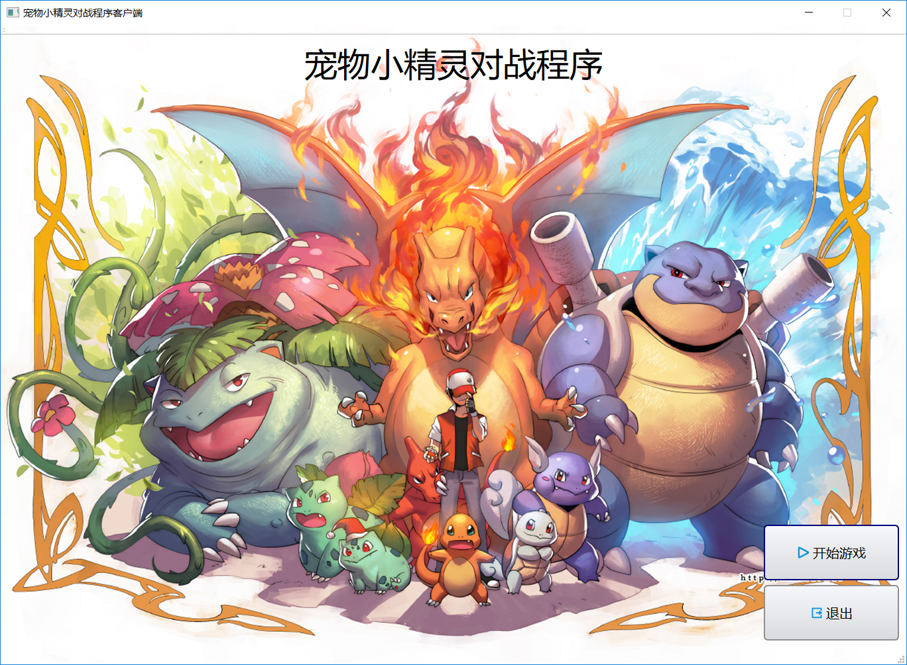
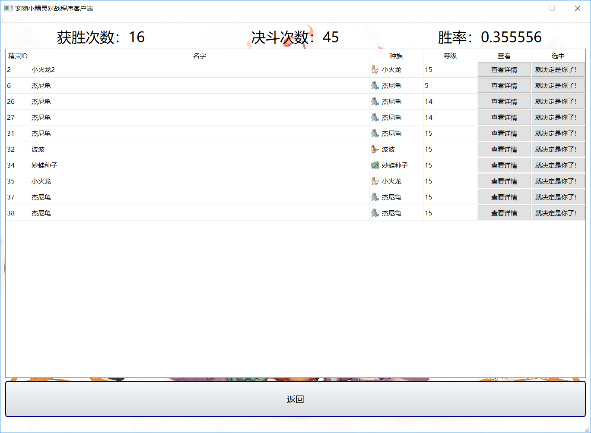
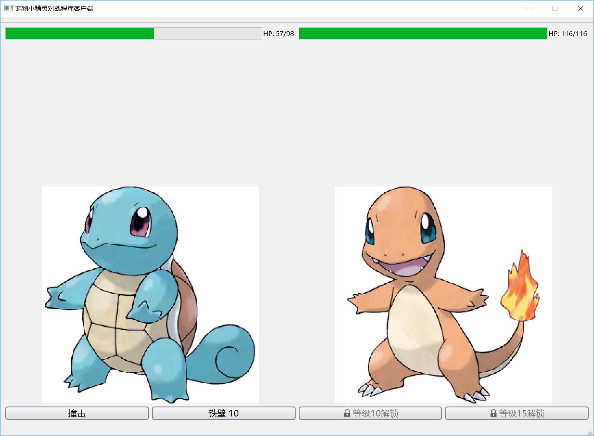

# PokeFighter

A little desktop game.

Pictures are from the Internet. All rights reserved.

Using Qt to implememt client, and Visual Studio to implement server.

## Requirement

Files in `phase*/server/` are using UTF-8 to encode characters. To compile them with Visual Studio and display Simplifies Chinese characters, convert those files from UTF-8 encoding to GB2312.

This game has a bgm. If you can't hear it, please try to install *LAV filters*.

